# Documentación Proyecto

Aquí realizaremos la documentación del proyecto, actualmente estamos realizando `SEGUNDO PROYECTO`.

  

   PRIMER PROYECTO🛠️
  

  
## ÍNDICE

1. IDEA DEL PROYECTO Y OBJETIVO DEL TRABAJO
2. OBLIGATORIO A APLICAR
3. LOGO DEL EQUIPO
4. PALETA DEL EQUIPO
5. TAREAS DE LOS INTEGRANTES
6. MOCKUP Y ARBOL DE NAVEGACIÓN
7. ARQUITECTURA DEL SISTEMA Y FUNCIONALIDADES
8. DIAGRAMA DE LA BASE DE DATOS
9. ESQUEMA DE RED
10. CONFIGURACIÓN DE PROXMOX
11. CONFIGURACIÓN DE DNS
12. CONFIGURACIÓN DE DHCP
13. CONFIGURACIÓN DE NGINX
14. BASE DE DATOS
15. CAMBIOS EN LA WEB
16. FUNCIONALIDADES
17. NUESTO FURTURO
18. VALORACIONES DEL PROYECTO
19. INCIDENCIAS TÉCNICAS
20. BIBLIOGRAFIA

    
## 1.IDEA DEL PROYECTO Y OBJETIVO DEL TRABAJO

Nuestra idea del proyecto se basa en diseñar una aplicación web inspirada en el popular juego de Fantasy Football. El fantasy es un juego donde los usuarios crean su propio equipo, y la finalidad de este juego es obtener los máximos puntos posibles, estos puntos se consiguen mediante tus jugadores, los jugadores en la vida real dependiendo de como juega un partido, puede obtener muchos puntos o muy pocos puntos. Como ejemplo de puntuacion, si un jugador no tiene minutos de juego entonces tendra 0 puntos, y si otro jugador marca 4 goles, possiblemente tendra una puntuación de 25 puntos. 

Entonces nuestra idea es crear una página relacionada con esta idea. Hemos elegido esta idea porque ambos integrantes del equipo sabemos más o menos cómo funciona el futbol fantasy, y por eso creemos que es una gran opción escoger este tema, ya que nos parece muy interesante.

Nuestro objetivo será aplicar todas las tecnologías necesarias para aspirar a la máxima nota posible y poner en práctica los conocimientos aprendidos en el primer año, así como lo que aprenderemos en este segundo año, para hacerlo lo mejor posible. También el año pasado un grupo escogio la misma idea y viendo como lo hicieron, vimos sus errores y pensamos que lo podemos hacer mucho mejor.

Con el trello y el github mostraremos todo nuestro trabajo realizado para mostrar nuestros avanzes semanales y diarios

## OBLIGATORIO A APLICAR

__-Node.js & MySQL:__

Node.js es un entorno de ejecución para JavaScript en el servidor, ideal para construir aplicaciones web rápidas y escalables. 

MySQL es un sistema de gestión de bases de datos relacional que almacena y organiza datos de manera eficiente, facilitando consultas rápidas.

__-NGINX o Apache:__ 

Ambos son servidores web populares. NGINX es conocido por su rendimiento y capacidad para manejar múltiples conexiones simultáneas, 
mientras que Apache es altamente configurable y tiene una gran cantidad de módulos disponibles.

__-DNS + DHCP:__ 

DNS (Sistema de Nombres de Dominio) traduce nombres de dominio en direcciones IP, facilitando la navegación web. 

DHCP (Protocolo de Configuración Dinámica de Host) asigna automáticamente direcciones IP a dispositivos en una red, simplificando la gestión de redes.

## 2.LOGO DEL EQUIPO

Nuestro logo lo hemos creado basándonos en el nombre de nuestro trabajo, Team Tactics. En él, se pueden ver dos "T" que hacen referencia al nombre del equipo. Tambien, hemos pensado este logo ya que con la forma y sus colores tiene mucha relación con el mundo del futbol.

El color negro y blanco creemos que queda muy estetico, que es eso lo que buscamos y lo que nos interesa.

## 3.PALETA DEL EQUIPO

Los colores con los que vamos a trabajar son los siguientes, hemos considerado que esta paleta de colores puede cuadrar muy bien con la funcionalidad de la web y puede atraer visualmente a nuestro público objetivo
ya que son colores muy visuales y relacionados con el mundo de los videojuegos.

__-000000__

__-00FF00__

__-FFFFFF__

## 4.TAREAS DE LOS INTEGRANTES

Ambos integrantes tocaremos de todo un poco. La idea es que los dos programemos, hagamos la base de datos, etc. Ahora estamos los dos trabajando juntos, y empezaremos cada uno a hacer sus 3 funcionalidades.

## 5.NUESTRO MOCKUP Y ARBOL DE NAVEGACIÓN

Hemos diseñado un mockup de la aplicación a través de Canva, basándonos principalmente en nuestra paleta de colores. Además, hemos realizado un diseño lo más visual posible para atraer la atención del público que creemos podría estar interesado en nuestra aplicación. Nuestro público objetivo son hombres entre 13 y 40 años.

Aquí explicaremos el arbol de navegación de nuestra página web.
Para empezar tendremos una página principal, donde a la parte superior derecha se vera los siguentes botones:
 - Inicio
 - Plantillas
 - Estadísticas
 - Contacto
 - Login

El boton de inicio es para que cuando accedas a otro boton te lleve a la pagina principal.

El boton de plantillas te llevara al apartado de tu plantilla/equipo

El boton de estadísticas te llevara a la parte de estadisticas globales

EL boton de contacto es para que el usuario acceda a la pagina con su usuario creado. En ese apartado podrà iniciar sección.

Abajo de todo esto, se veràn los 20 escudos de la liga, donde si hacemos click a un escudo te llevara a ver información de ese equipo como: Plantilla, sitio en la clasificación etc..

Entonces abajo de esto mostraremos el mensaje de Juega a teamtactics, esto es para que el usuario vea de una forma un esquema de lo que va la web

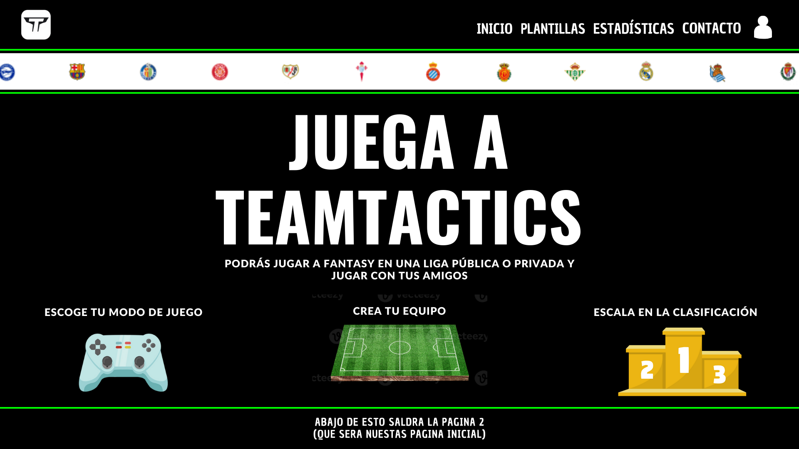

Abajo de esto, veremos un apartado de pròximos partidos y lideres de la liga, ambas son como una mínima información. En cada apartado tendrá abajo derecha un boton que pondra como: Ver todos los partidos/Estadísticas, que te llevara a otro sitio, para ver toda la información.

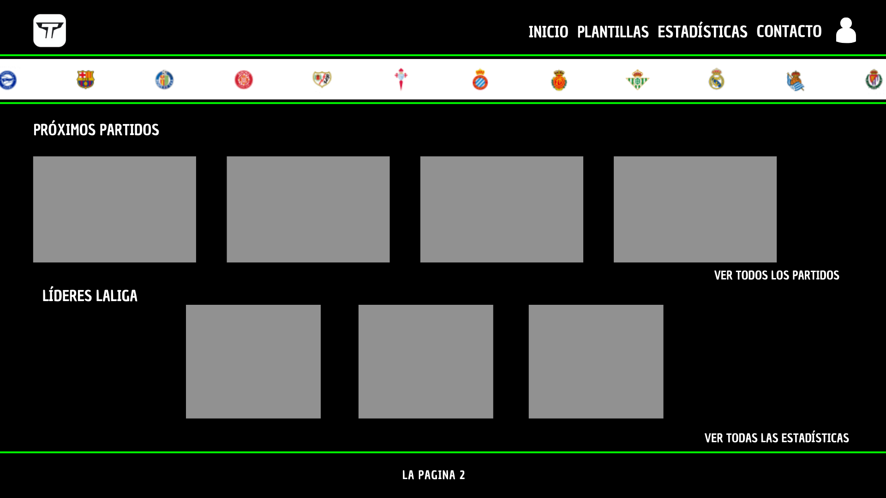

Entonces, si le damos al botón de arriba derecha de estadísticas, te llevará a una página donde salgan todas las estadísticas, donde podremos ver:

 -Máximos goleadores
 

 -Máximos asistententes
 
 
 -Jugador con más disparos
 
 
 -Jugador con más pases.
 

 -Portero con más paradas.
 

 -Jugador con más tarjetas amarillas y rojas.

 Cada jugador que salga, si por ejemplo el jugador que es el máximo goleador es Lewandowski, saldrá el escudo del equipo y los minutos jugados.

Esta página de estadísticas también se podrá llegar a parte del botón arriba derecha en la parte que he comentado donde decía: Ver todas las estadísticas
Y si le damos al botón de ver todos los partidos, que se encuentra a abajo del todo de la página principal, nos llevará a otra página donde veremos todos los partidos jugados, y los puntos que todo el equipo ha conseguido, esto servirá para que el usuario mire los puntos que ha hecho cada jugador.

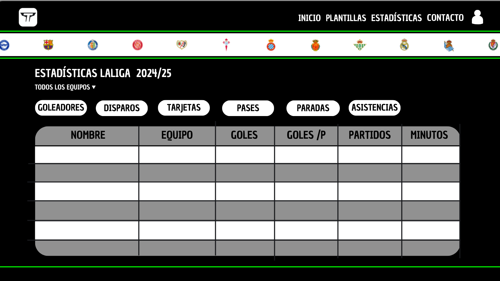

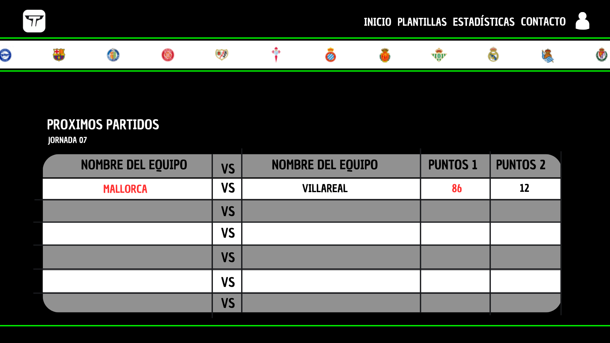

Ahora, en la página principal, si le damos a Crea tu equipo, te llevará a la página donde el usuario podrá crear el equipo. En esta página, se verá de fondo como un campo de fútbol negro, para que el usuario ponga sus jugadores a cada posición que corresponde.
Arriba, dentro de la misma página, se verá un balance. El balance principal empieza con 100.000.000, luego si el usuario hace incorporaciones, entonces el balance bajará. 
Abajo de esto, se verá un apartado de puntos, donde el usuario verá la suma total que ha realizado su equipo.
Y arriba derecha se verá el número de jugadores que tiene puestos en el campo de fútbol, normalmente esto será simple 11/11.

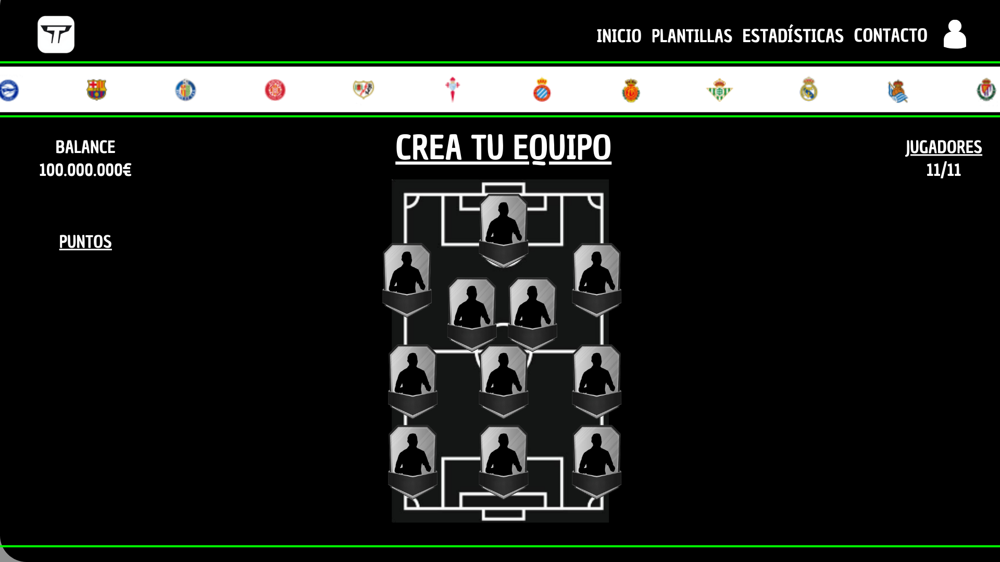

La opción de número de jugadores funcionará como un botón, donde, si hacemos click a esto, veremos nuestros jugadores, nombre, club, media puntos, puntos que ha hecho en una jornada y el valor de mercado.
La media de puntos se hará haciendo una media de los 37 partidos jugados.

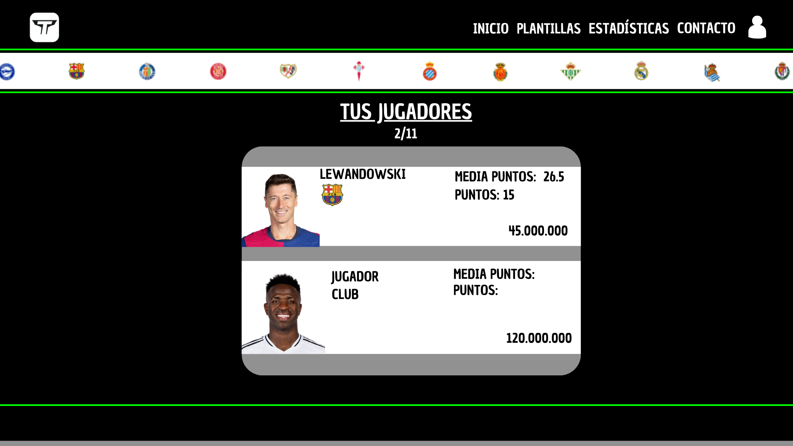

También se verá un botón de mercado, para que el usuario pueda comprar jugadores en el mercado.
Todos los jugadores que el usuario ha comprado también pueden ser vendidos.

Luego, en el botón contacto pondremos un poco de información de nosotros para explicar un poco dentro de la página web el proceso del proyecto.

Y en el botón de inicio de sección, el usuario podrá hacer registro para poder acceder con su cuenta a la página, claro que si no tiene cuenta, tendrá que darle a crear cuenta, y luego de crear cuenta le tendrá que dar a iniciar sección.
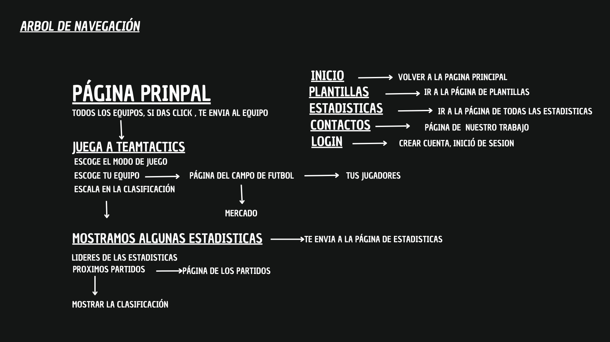

El mockup y nuestra idea del trabajo creo que lo hemos entendido perfectamente. Sabemos que el árbol de navegación no será el mejor de la historia, pero para nosotros nos sirve cómo una buena guía de cómo funcionará la página.

## 6.ARQUITECTURA DEL SISTEMA Y FUNCIONALIDADES

Nuestros objetos serán:
- Registro de usuarios
- Una zona de comentarios para todos los usuarios que se hayan agregado como amigos
- Una zona donde el usuario podrá modificar su perfil.
- Poner notificaciones para los usuarios
- Búsqueda de usuarios y poder agregarlos como amigos
- Y hacer obligatorio el uso de contraseña para cuando se entra a la aplicación.

  El día de la fecha de entrega puede variar

Ahora mostramos la arquitectura de nuestro trabajo.
  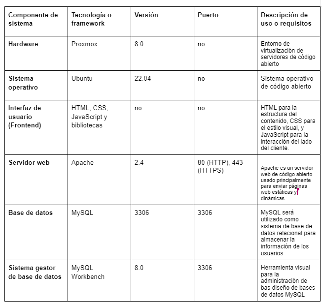

## 7.DIAGRAMA DE LA BASE DE DATOS

Los usuarios crean sus propios equipos, que consisten en jugadores de equipos reales, organizados en plantillas. 

Los usuarios pueden participar en ligas, competir entre sí y realizar transacciones de compra y venta de jugadores. Para calcular las puntuaciones, 
Se registran los partidos reales y las puntuaciones obtenidas por cada jugador en esos encuentros. 

Además, hemos incluido un sistema de Amigos, así como Roles para gestionar diferentes tipos de usuarios en la plataforma.

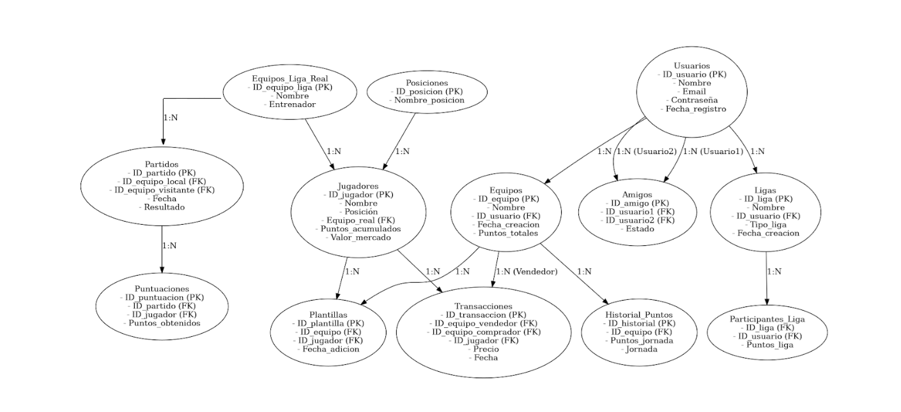

## 8.ESQUEMA DE RED

Por el momento tenemos hecho este prototipo de mapa de red, aunque aun lo tenemos que hablar con Alina ya que no es el definitivo y queremos que nos aclare algunos conceptos que quizas no han quedado tan claros.

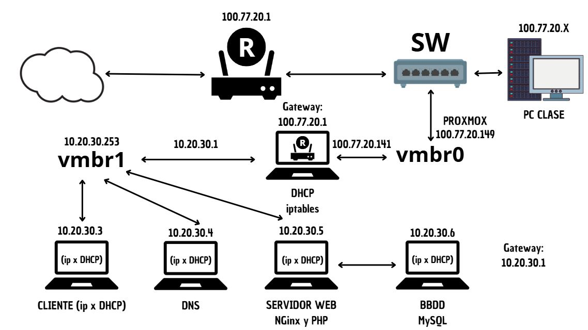

## 9.PROXMOX Y SU CONFIGURACIÓN

Por el momento, ya tenemos instalado el ProxMox en el PC de clase asignado de los que están atrás del todo. Una vez tengamos más claro el esquema de red definitivo, procederemos a empezar a configurarlo y documentarlo.

__Proxmox__ es una plataforma de virtualización de código abierto que permite gestionar máquinas virtuales y contenedores. Está basada en Debian y combina tecnologías como KVM (para la virtualización completa) y LXC (para la virtualización basada en contenedores).

Se utiliza principalmente en entornos de servidores para crear, administrar y orquestar múltiples VMs y contenedores de forma eficiente. También incluye herramientas para gestionar almacenamiento, redes y copias de seguridad. Además, soporta la creación de clusters para alta disponibilidad y migraciones en vivo, lo que lo hace ideal para centros de datos y servidores corporativos.

Es especialmente útil para:

-Consolidación de servidores: Ejecutar múltiples sistemas operativos en un solo servidor físico.

-Gestión de recursos: Controlar y distribuir recursos de hardware como CPU, memoria y almacenamiento.

-Automatización y alta disponibilidad: Ofrecer soluciones escalables y resistentes a fallos.

[Ver archivo](M11UF4A2-QuimFernandez_PolCamarena.docx.pdf)

Creamos ROUTER con vmbr0 y vmbr1 para que todo el proyecto funcione de manera correcta.

Ahora creamos Cliente con vmbr1 

Creamos DNS  con vmbr1

## 11.DNS Y SU CONFIGURACIÓN 

¿Qué es el DNS?

El DNS es  un servicio distribuido a nivel global que permite convertir los nombres de los sitios en las direcciones IP que les corresponde.
Cuando un usuario registra un dominio, se crea una entrada WHOIS en el registro correspondiente y queda almacenada en el DNS como un
resource record.
La base de datos de un servidor DNS se convierte en la compilación de todos los registros de la zona del espacio de nombres de dominio que gestiona.

Registros del DNS:

A (Address Record): Mapea un nombre de dominio a una dirección IPv4.

AAAA (IPv6 Address Record): Mapea un nombre de dominio a una dirección IPv6.

MX (Mail Exchange): Define qué servidor gestiona el correo electrónico para el dominio.

CNAME (Canonical Name): Apunta un dominio a otro dominio.

NS (Name Server): Especifica qué servidores DNS son responsables de un dominio.

PTR (Pointer Record): Utilizado en la búsqueda inversa de DNS, mapea una IP a un nombre de dominio.

Información del DNS

El servicio de DNS se encuentra en la capa de aplicación del modelo OSI.

La capa más cercana al usuario y contiene todos los protocolos de alto nivel como SMTP, DNS y HTTP.

Este protocolo de red emplea la capa de transporte TCP, UDP y utiliza el puerto 53.

Tipos de Consultas:

Consulta recursiva: Si el servidor DNS local no sabe la respuesta, realiza consultas a otros servidores DNS.

Resolución iterativa: Si un servidor DNS no tiene la respuesta directa, le da al cliente la dirección de otro servidor que puede tenerla. 

VENTAJAS DEL DNS

Una ventaja es que resuelve el problema de las colisiones o nombres duplicados porque garantiza que todos los nombres hermanos o hijos de un mismo nodo tengan etiquetas o nombres diferentes.

Elimina los problemas del sistema basados en el fichero HOSTS.TX

Y tambiém permite "particionar" y gestionar los diferentes subdominios de modo independiente.

CONFIGURACIÓN DEL DNS EN PROYECTO

Para empezar la configuracióm, actualizamos los repositorios de nuestro sistema:

sudo apt update

Y ahora instalamos el paquete bind9:

sudo apt install bind9

Editamos el netplan, lo ponemos con DHCP y lo editamos para poder avanzar de forma correcta

Ahora si ponemos ip a, veremos que mediante DHCP, tenemos asignada la IP 10.20.30.4

Entonces ahora vamos al archivo que se llama named.conf.local , que bàsicamente es donde haremos la configuración DNS de la zona inversa y directa

El named.conf.local lo utiliza por el servidor DNS BIND para configurar zonas específicas y personalizadas, como dominios locales o zonas reversas. 

Permite definir configuraciones locales que el servidor manejará, como:

Zonas directas: Traduce nombres de dominio a direcciones IP.

Zonas inversas: Traduce direcciones IP a nombres de dominio.

Para comprobar que la configuración ha sido correcta y que no hemos tenido ningun problema ponemos:

named-checkconf

Ahora creamos los dos archivos de la zona directa y inversa

Ahora, accedemos al archivo de la zona directa y lo configuramos para comprobar que funcione de forma correcta

La zona directa de DNS es una configuración que mapea nombres de dominio a direcciones IP.

En nuestro caso el servidor DNS manejará el dominio quimpol.local  y usará el archivo db.quimpol.local para almacenar.

Y ahora haremos lo mismo pero para la zona inversa

Lo que hace la zona inversa es que  está buscando el nombre de dominio asociado con una dirección IP determinada.

En nuestro caso la IP  es la 10.20.30.4,

Entonces nuestra dirección IP, que es la 10.20.30.4, nos  permitirá resolver esa IP al nombre de nuestro dominio, el quimpol

Y tambien ya lo ponemos para la configuración con la MV de cliente

Ahora para comprobar que toda la configuración de los ficheros de zonas se ha realizado correctamente, hacemos lo siguiente:

Ahora nos tocaría editar el fichero 
/etc/bind/named.conf.options

Esto lo que hace es configurar parámetros globales y opciones predeterminadas que se aplican a todas las zonas y consultas DNS gestionadas por el servidor.

Modificamos el archivo y en listen ponemos la 10.20.30.4 que es para que servidor DNS escuchará consultas.

 

Ahora, vamos al archivo
/etc/default/named 

El archivo /etc/default/named controla cómo se inicia el servicio BIND

Que es donde especificaremos la opción -4 como argumento para el usuario bind, que  se crea automáticamente durante la instalación del servicio bind9. 

La opción -4 , nos sirve para forzar el uso de IPv4 siempre y evitar  mensajes de error de red inalcanzable por direccionamiento IPv6.

Ahora reiniciamos el servicio bind9 y ver si todo esta correcto

Ahora mediante el nslookup, comprobamos si el servidor DNS está resolviendo correctamente los nombres y las direcciones IP

## 12.CONFIGURACIÓN DE DHCP

Primero lo que hacemos es instalar el servicio DHCP:

Actualizamos: sudo apt update

sudo apt-get install isc-dhcp-server

Hacemos la configuración del archivo DHCP:

El archivo de configuración principal se encuentra en /etc/dhcp/dhcpd.conf. En este archivo, lo que hay que hacer es definir los parámetros de red, como el rango de direcciones IP, la puerta de enlace predeterminada, DNS y duración de la concesión. 

   
Esta es nuestra configuración en el netplan:

Configurar las interfaces de red:

Ahora  para comprobar y asegurarnos que la interfaz de red correcta esté configurada para proporcionar el servicio DHCP definimos  la interfaz en el archivo de configuración de red o directamente en /etc/default/isc-dhcp-server:

Reiniciar el servicio DHCP:

Una vez configurado, hay que reiniciar el servicio para aplicar los cambios:

sudo systemctl restart isc-dhcp-server
Comprobación:

 Y para verifica si el servidor DHCP está funcionando correctamente:

sudo systemctl status isc-dhcp-server

## 13.CONFIGURACIÓN DE NGINX

Para empezar, instalamos el nginx con el comando:

sudo apt-get install nginx

Entramos al netplan y configuramos para que funcione de forma correcta

Vemos con el ip a que nos da la IP mediante DHCP, la 10.20.30.5

Ahora tenemos que editar el archivo nginx.conf que se encuentra en /etc/nginx

Eel archivo de configuración global es: 

/etc/nginx/nginx.conf

Entonces ahora, con el  el directorio  /etc/nginx/sites-enabled/ , lo que haremos será almacenar los  los enlaces simbólicos a los archivos de configuración de sitios web creados en 
/etc/nginx/sites-available/  para que puedan ser habilitados los sitios

Ahora editamos el archivo /sites-available/default, que en este caso sería el bloque predeterminado del servidor de Nginx

Php:

¿Qué es php?

PHP es un lenguaje de programación de propósito general ampliamente utilizado para el desarrollo de aplicaciones web del lado del servidor

Características principales:

Dinámico y orientado a la web:

PHP se usa principalmente para generar contenido dinámico en páginas web.
Puede interactuar con bases de datos, manejar formularios y autenticar usuarios.

Integración con HTML:

PHP se incrusta directamente en archivos HTML, lo que facilita la creación de páginas web dinámicas.

Compatibilidad multiplataforma:

PHP funciona en varios sistemas operativos, como Windows, Linux y macOS.
Es compatible con la mayoría de los servidores web, como Apache, NGINX.

Para instalar el php ponemos:

sudo apt install php-fpm

Para verificar si tenemos instalado PHP ponemos:

php -version

Para comprobar si tenemos php-fpm ponemos:

php-fpm7.4 -v

## ACTIVIDAD ENTREGADA EN LA MEMÓRIA (ALINA)

¿Qué es un servidor web?

Un servidor web es un software que forma parte del servidor y tiene como misión principal devolver información (páginas) cuando recibe peticiones por parte de los usuarios.

En otras palabras, es el software que permite que los usuarios que quieren ver una página web en su navegador puedan hacerlo.

¿Qué es un hosting?

Un hosting es un servicio de alojamiento web que te permite publicar un sitio web o aplicación en Internet. Cuando contratas un servicio de hosting, básicamente alquilas un espacio en un servidor físico donde puedes almacenar todos los archivos y datos necesarios para que tu sitio web funcione correctamente.

¿Qué es Nginx?

Nginx, pronunciado como “engine-ex”, es un servidor web de código abierto que, desde su éxito inicial como servidor web, ahora también es usado como proxy inverso, cache de HTTP, y balanceador de carga.

Algunas compañías de alto perfil que utilizan Nginx incluyen Autodesk, Atlassian, Intuit, T-Mobile, GitLab, DuckDuckGo, Microsoft, IBM, Google, Adobe, Salesforce, VMWare, Xerox, LinkedIn, Cisco, Facebook, Target, Citrix Systems, Twitter, Apple , Intel, y muchos más

Haz una comparativa entre Nginx y Apache.

Nginx:

Usa una arquitectura basada en eventos y asincrónica, lo que le permite manejar múltiples conexiones simultáneamente con menos recursos.
Es ideal para cargas altas y servidores con tráfico masivo.
Excelente para servir contenido estático (imágenes, archivos HTML, etc.) rápidamente.

Apache:

Emplea un modelo de procesos/hilos, donde cada conexión consume un hilo o proceso. Esto puede ser ineficiente bajo cargas pesadas.
Ofrece más flexibilidad para manejar configuraciones complejas gracias a sus módulos dinámicos.

## 14.BASE DE DATOS

Aquí mostramos el esquema final de la base de datos, donde hemos añadido algunas conexiones que no habíamos tomado en cuenta. Hemos creado la base con MySQL WorkBench a través de SQL y una vez ejecutado el código, gracias a la función de la creación de diagramas, hemos podido ver las tablas y sus conexiones.

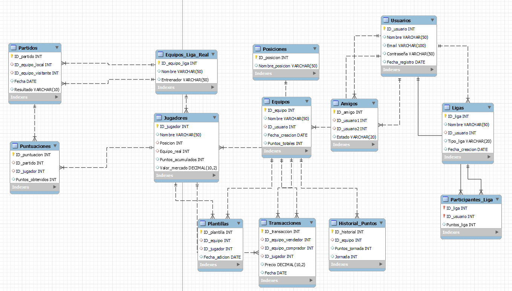

## 15.NOVEDADES/CAMBIOS DE LA WEB

Para empezar, hemos hecho nuchos cambios respectivamente a la idea que decimos hacer al principio de la web, la idea que me estoy refiriendo, es toda esa explicación que hicimos al principio del github, que es donde esta esa explicación con capturas que nosotros mismo hicimos del canva del boceto de la idea principal del proyecto.

Como página principal, seguimos teniendo lo mismo, una página donde el usuario pueda ver arriba derecha los botones de estadísticas, plantilla y login, etc..
Y que si va bajanda podrá ver la zona de estadísticas y resultados, que esta linkeado a otra página, ya que se podrá ver y entender mucho mejor  bajo nuestro punto de vista

Entonces, creemos que lo mas importamte que llevamos hecho es la parte de  plantilla, ya que lo que hicimos fue crear en nuestra bbdd, todos los jugadores de todas las plantillas de laliga.

Eso lo hicimos poniendo a cada equipo un numero, del 1 al 20, ya que son 20 equipos, entonces lo siguiente era poner a cada posicion del campo, del 1 al 5, osea 1 es portero 2 es defensa, 3 es mediocampista, 4 delantero y 5 que sea la posicion del banquillo, entonces ahora abria que poner 11 jugadores con 1,2,3 y 4 osea, 1 jugador con 1, 4 jugadores con el numero 2, 3 jugadores con el numero 3 y 3 jugadores con el numero 4, esto suma a 11. Y  los otros jugadores, da igual que sean 10 o 20, todos estaran con el numero 5, que será en la posicion de banquillo. Entonces despues de poner todo en la bbdd lo que hicimos fue conectarlo para nuestra pagina web, entonces si ahora por ejemplo le doy click al escudo del getafe, me saldriá el 11 de jugadores, y el banquillo, también tengo que decir que cada equipo tiene también puesto la imagen y nombre del entrenador

Entonces lo que hicimos en estadisticasm fue ponerlas de forma manualmente, ya que con el tiempo que quedaba para entregar el trabajo era imposible acabarlo

## 16.FUNCIONALIDADES

Aquí como funcionalidades, tenemos:

1. Register: El usuario se puede registrar a nuestra página, esto con la bbdd entre medio, haciendo que cuando el usuario se registra se pueda ver en nuestra bbdd como usuario
2. Login: El usuario después de registrase puede acceder a nuestra página ya como usuario

3. Plantilla: Esta funcionalidad es la de plantillas, es decir todo lo que he explicado antes, hay que decir que para hacer esto tardamos mucho tiempo, pusimos manualmente unos 1000 links en la bbdd entre imagenes de jugadores, entrenadores y escudos.

4. Contactarnos: Esta función esta en procedimiento, y basicamente es para que los usuarios nos puedan enviar un mensaje para dudas/críticas/valoraciones etc..

Creemos que las 4 funcionalidades para nuestro trabajo son muy buenas ideeas, ya que conjuntan perfectamente a nuestra idea prinpial

## 17.NUESTRO FUTURO

Creemos que para la siguente UF, podemos seguir con nuestro proyecto, ya que tenemos aún muchas buenas ideas para seguir mejorando y aprendiendo. Esto lo defenderemos en la exposición del proyecto hasta la muerte
Algunas ideas serián:
- API de resultados
- Poder básicamente hacer el FANTASY, con que cada persona pueda hacer su equipo, y competir con otros jugadores

## 18.VALORACIONES DEL PROYECTO

Creemos que en el proyecto hemos aprendido muchisimo, con las instalaciones de las diferentes máquinas virtuales, con el nuevo conocimiento como nginx, o php. O también con el constante trabajo diario y semanal sobre una idea que poco a poco hemos ido creando y mejorando.

Y personalmente a los dos intregantes del equipo nos parece por ahora seguir con nuestro trabajo en la próxima UF

## 19.INCIDENCIAS TÉCNICAS

Mala configuración en el DNS, por falta de no haber reiniciado el servicio despues de modificarlo

Otro fail....

En incidencias durante las instalaciones de las MV no tuvimos muchos errores, y los únicos que tuvimos eran por equivocaciones de escritura y palabras.
Pero donde si tuvimos muchos errores fue durante la creación de la bbdd, ya que al crear plantilla , donde pusimos muchos datos, nos equivocamos mucho, pero poco a poco esos errores se fueron arreglando hasta el dia de hoy que nuestra bbdd funciona perfectamente

  
SEGUNDO PROYECTO💻

## ÍNDICE

1. IDEAS PARA EL SEGUNDO PROYECTO
2. FUNCIONALIDADES
3. ARQUITECTURA
4. DIAGRAMA DE RED
5. DIAGRAMA DE LA BASE DE DATOS
6. TECNOLOGÍAS
7. HARDWARE
8. SISTEMA OPERATIVO
9. TAREAS
10. FUNCIONALIDADES HECHAS
11. DOCKER COMPLETO
12. DOCKER COMPOSE
13. SERVIDOR DE CORREO  (POSTFIX)

    
## 1.IDEAS PARA EL SEGUNDO PROYECTO

### NUEVAS FUNCIONALIDADES

#### PENDIENTES
- Opción de cambio de contraseña
- Formulario de Contacto

#### NUEVAS EN LA WEB
- Implementación de una API: recrear la web a partir de la API que nos permitirá añadir la función de las estadísticas actualizadas de los jugadores.

- Agregar como amigos a los usuarios

- Implementación del juego:

    Está para nosotros es la parte mas importante, aquí pondremos de novedades:
    
    Los jugadores se puedan agregar como si fueran amigos
  
    Una página donde los usuarios puedan crear sus equipos, saldrá su 11 inicial, y también habrá un apartado para ver todos sus jugadores ( a parte del 11 inicial)
  
    Una página donde los usuarios podrán comprar los jugadores, hará la misma función que un mercado, allí apareceran todos los jugadores de futbol disponibles para ser comprados
  
    Una página que funcionará como si fuera una clasificación donde los jugadores con más puntos conseguidos apareceran, así será más competitivo y hará el juego más interesante para los usuarios

#### OBLIGATORIAS
- Docker
- FireWall
- Backups (script)
- Seguridad:
  - MySQL (crear más de un usuario, securizar la DB, triggers)
  - Protección de código fuente
 
## 2.FUNCIONALIDADES

Los dos, Quim y Pol haremos la funcionalidad del juego Fantasy, ya que es una funcionalidad muy larga y compleja, y necesitamos que los dos lo hagamos para poder acabar

La funcionalidad de la API la hará Pol

La funcionalidad de cambio de contraseña la hará Quim

La funcionalidad de agregar amigos la haremos cuando acabemos la del Juego Fantasy, ya que preferimos insistir con el tiempo en terminar la funcionalidad del juego fantasy por su gran importancia y valor en nuestro proyecto, ya que es en lo que se basa nuestra idea de proyecto

## 3.ARQUITECTURA DEL SISTEMA

Esta será mas o menos nuestra arquitectura, no es definitivo pero por ahora es lo que tenemos como idea

## 4.DIAGRAMA DE RED

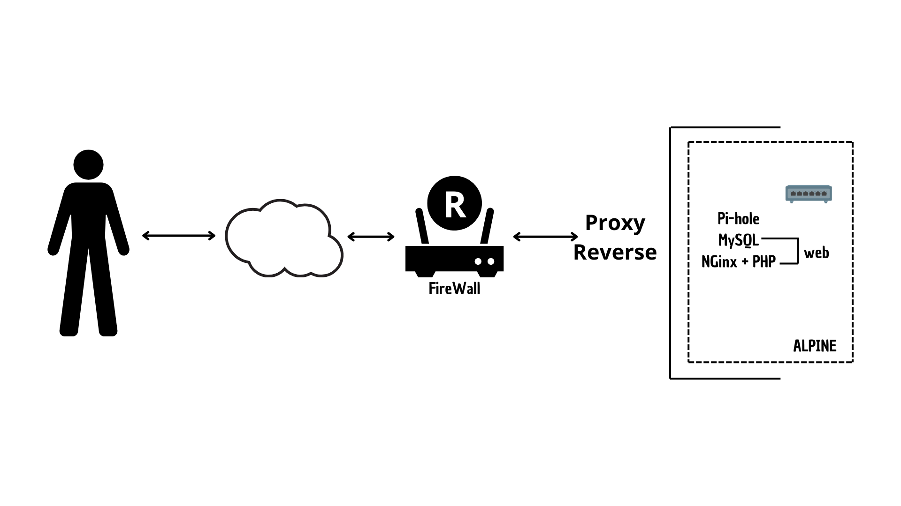

## 5.DIAGRAMA DE LA BASE DE DATOS

Esta es nuetra base de datos, es la misma que la del primer proyecto pero con pequeñas variaciones ya que como comentamos seguimos con el mismo proyecto entonces la infraestructura de la base de datos por narices tiene que ser muy parecida ya que mas o menos ya esta de alguna manera terminada

Si tenemos más tiempo alomejor podemos añadir alguna tabla más a la base de datos, pero por ahora es lo que tenemos

 ## 6.TECNOLOGÍAS

En este segundo proyecto tenemos la intención de agregar ciertas tecnologías a nuestra web que nos permitirán aumentar la seguridad y eficiencia a la hora de funcionar y monitorizar la. Anteriormente ya habíamos trabajado con algunas como Proxmox, Ubuntu, Html/Css, JavaScript, NGinx, MySQL, PHPMyAdmin, bibliotecas, frameworks, etc.
Aparte de estas tecnologías, agregaremos algunas como; Docker, Portainer, alguna API, Pi-Hole, aplicaremos FireWall, y algunas que iremos añadiendo según las necesidades que encontremos a la hora realizar el proyecto.

## 7.HARDWARE

Para este segundo proyecto seguiremos usando el ordenador de clase asignado a nuestro grupo específicamente, en nuestro caso usaremos uno nuevo ya que no sabemos como a pasado pero nuestro antiguo ordenador con toda la infraestructura de Proxmox a desaparecido y ahora no nos queda otra que volver a montarlo todo pero esta vez utilizando los contenedores de Docker con los que trabajaremos en este segundo proyecto.

## 8.SISTEMA OPERATIVO

Principalmente íbamos a usar Alpine Linux ya que nos ofrece mucha eficiencia en cuanto a recursos, ya que es conocida por su tamaño reducido, lo que la hace muy popular en entornos donde se necesita un sistema ligero, como en contenedores Docker. 

Pero trás varias pruebas con el, nos dió ciertos problemas que finalmente nos hizo decantarnos por utilizar un Ubuntu Server ya que ya habíamos trabajado anteriormente con ese sistema. Este nos ofrece ventajas como:

Familiaridad y eficiencia: Ya teníamos experiencia con Ubuntu, lo que facilitó la gestión y configuración de los contenedores sin perder tiempo en aprender un nuevo sistema.

Soporte y estabilidad: Ubuntu Server ofrece un soporte robusto y actualizaciones regulares, lo que garantiza seguridad y estabilidad a largo plazo, vital para producción.

## 9.TAREAS

Ahora mismo por problemas no podimos empezar en la creación de la infraestructura de la Ubuntu o Alpine.
El 29/01 empezamos con docker y los containers, y desde una MV de ubuntu server, ya que desde Alpine hubo algunos problemas y preferimos utilizar la ubuntu por la razón de que ya la hemos usado mucho, entonces empezamos a crear la estrucura y importamos el sitio web en docker, luego dentro de nginx configurmos el default.conf, luego en mysql lo tenemos vació por ahora y ahora estamos con el docker compose. 
Creo que para el proximo miercoles 5/02 ya lo tendremos terminado ya que Alina y algunos compañeros nos han dado explicaciones para entenderlo mejor y asi hacerlo de alguna forma un poco mas rapido para asi aprovechar el tiempo al maximo para llegar al ritmo de la clase

## 10.FUNCIONALIDADES HECHAS

Por ahora hemos realizado la funcionalidad de canvio contraseña, y también la funcionalidad de que el usuario no pueda inpeccionar nuestro código, aplicando un poco de seguridad para nuestra página web

## 11.DOCKER 

INTRODUCCIÓN DE DOCKER

Bueno para empezar, un poco sobre que es Docker, Docker es una plataforma de contenedorización que permite a los desarrolladores empaquetar aplicaciones y sus dependencias en contenedores ligeros y portátiles. 
Estos contenedores pueden ejecutarse de manera consistente en cualquier entorno, ya sea en una computadora local, en servidores o en la nube.

Nosotros en nuestro caso usamos Docker ya que aparte de que es obligatorio, es mucho más rápido que iniciar o detener máquinas virtuales y también Docker es mas eficaz ya que las MV

Ahora mostraremos algunos comandos, ya que creemos que es importante dentro de la introducción, y asi mostramos alguna información de Docker 

docker version:   	Muestra la versión instalada de Docker.

docker info:  Muestra información detallada sobre Docker y su configuración.

docker help: Muestra ayuda sobre los comandos de Docker

docker run <imagen>	Ejecuta un contenedor basado en una imagen.

docker run -d -p 8080:80 <imagen>	Ejecuta un contenedor en segundo plano y expone un puerto.

docker ps	Lista los contenedores en ejecución.

docker ps -a	Lista todos los contenedores (ejecutándose o detenidos).

docker stop <id>	Detiene un contenedor en ejecución.

docker rm <id>	Elimina un contenedor detenido.

Ahora explicaremos algunas ventajas de Docker

Tenemos que los contenedores Docker pueden ejecutarse en cualquier entorno sin cambios, ya sea en Windows, Linux, MacOS, servidores o en la nube y también evita problemas de dependencias, configuraciones o versiones de software diferentes en cada entorno.
Los contenedores comparten el mismo sistema operativo, lo que reduce el consumo de recursos y con Docker Compose, puedes definir y ejecutar múltiples contenedores con un solo archivo YAML

NUDO (DOCKER) GUIA DE USUARIO DE COMO INSTALAR / UTLIZAR DOCKER

Ahora lo que haremos será dentro del NUDO de Docker, como una mini guia sobre DOCKER, aquí intentaremos explicar sobre como instalar y utilizar DOCKER
Aqui ya decimos que lo montaremos dentro de una MV ubuntu server

Entonces para empezar, primero de todo lo que tendriamos que realizar sería actualizar los paquetes de ubuntu

sudo apt update

Entonces ahora lo que tendríamos que hacer seria instalar paquetes que permitan a APT descargar a través de HTTPS, ya que Docker se descarga desde un repositorio HTTPS, y es necesario instalar algunos paquetes para que lo habiliten

sudo apt install -y apt-transport-https ca-certificates curl software-properties-common

Ahora lo que tendriamos que hacer es importar la clave GPG para verificar que los paquetes que descargues desde el repositorio oficial de Docker 
Entonces podremos este comando:

sudo mkdir -m 0755 -p /etc/apt/keyrings
curl -fsSL https://download.docker.com/linux/ubuntu/gpg | sudo gpg --dearmor -o /etc/apt/keyrings/docker.gpg

Y ahora para poder instalar Docker, es necesario agregar su repositorio oficial a la lista de repositorios de tu sistema
Entonces pondremos este comando:

sudo add-apt-repository "deb [arch=amd64] https://download.docker.com/linux/ubuntu $(lsb_release -cs) stable"

Ahora después de esto esto, tendremos que actualizar nuevamente los paquetes del sistema:

Y ya luego de hacer todo esto procedimiento, ya podremos instalar el docker. 
Para eso pondremos este comando:

sudo apt install docker-ce

+

Y ya si queremos comprobar si el funcionamiento esta correcto, pondremos el siguiente comando para asegurarnos

sudo systemctl status docker

Vale, ahora para seguir con el procedimento, tenemos que tocar portainer

Portainer es una herramienta de administración para Docker con una interfaz gráfica fácil de usar. Permite gestionar contenedores, imágenes, redes y volúmenes sin necesidad de usar la línea de comandos.

Para empezar, nosotros hemos creado  un volumen de Docker llamado portainer_data para almacenar la base de datos de Portainer

docker volume create portainer_data

Ahora, comprobaremos si  el volumen se haya creado correctamente usando el comando:

docker volume inspect portainer_data

Ahora si ya podremos  instalar el contenedor de Portainer:

docker run -d -p 8000:8000 -p 9443:9443 --name portainer --restart=always -v /var/run/docker.sock:/var/run/docker.sock -v portainer_data:/data portainer/portainer-ce:latest

Ahora para comprobar si el contenedor está corriendo

docker ps

Y ya ahora si vamos al navegador y ponemos una IP con el puerto 9443

https://192.168.1.79:9443

Ya podriamos acceder al portainer donde se encontraran todos los contenedores DOCKERS

Bueno y en la foto de abajo, se ven todos los contenedores que tenemos montados, hay q decir q para poder tener todo eso tenemos que configurar diferentes archivos de configuración:

Tenemos estos dos archivos para poder realizar la configuración:

default.conf

docker-compose.yml

El  default.conf para que Nginx funcione correctamente como servidor web y define cómo manejar las solicitudes, redirigir tráfico y procesar archivos PHP. 

./teamtactics/nginx/default.conf

Bueno, el servidor escucha el puerto 80 y tenemos el nombre del servidor como localhost.

Luego, la definimos la carpeta donde se encuntra el contenido del sitio web:
root /var/www/teamtactics/TeamTactics/html

Primero busca index.htm, luego el index.html y luego el index.php
index index.htm index.html index.php;

Luego tenemos los registros de acceso y el de los errores, ya que guarda las solicitudes que recibe el servidor y también registra los errores

access_log /var/log/nginx/access.log;
error_log /var/log/nginx/error.log;

Esto ahora sería la configuracion de nuestros archivos que son PHP

    location ~ \.php$ {
        include fastcgi_params;
        fastcgi_pass php:9000;
        fastcgi_index index.php;
        fastcgi_param SCRIPT_FILENAME $document_root$fastcgi_script_name;
    }

Y ahora definimos las rutas para los archivos CSS, JAVASCRIPT, las imagenes y también todos los archivos subidos.
Todo estos archivos se sirven de:

/var/www/teamtactics/TeamTactics/

Estos creemos que son los mas importantes de explicar

El archivo docker-compose.yml es un archivo de configuración en formato YAML que se usa con Docker Compose para definir y ejecutar múltiples contenedores de Docker de manera organizada.

./teamtactics/docker-compose.yml

Dentro de este archivo tenemos la configuracion de 4 servicios de docker

phpfpm:
  image: php:8-fpm-alpine
  container_name: phpfpm
  working_dir: /var/www/teamtactics
  ports:
    - "9000:9000"
  volumes:
    - './web:/var/www/teamtactics'
  restart: always
  networks:
    - netweb

Este sería la configuración del PHP 
Donde se define el directorio de trabajo dentro del contenedor, en nuestro caso en teamtactics:

working_dir: /var/www/teamtactics

nginx:
  image: nginx:alpine
  container_name: nginx
  ports:
    - 8082:80
  working_dir: /etc/nginx
  volumes:
    - './web:/var/www/teamtactics'
    - './nginx/default.conf:/etc/nginx/conf.d/default.conf'
    - './nginx:/var/log/nginx/'
  restart: always
  networks:
    - netweb

Este sería la configuracion del nginx, y expone el puerto 80 del contenedor en el 8082 del host.
Comparte archivos del host con el contenedor:

./web:/var/www/teamtactics

Y también carga los archivos de la configuración de Nginx:

./nginx/default.conf:/etc/nginx/conf.d/default.conf

db:
  image: mysql
  container_name: miDB
  ports:
    - "3307:3306"
  environment:
    MYSQL_ROOT_PASSWORD: 1234
  volumes:
    - './mysql:/var/lib/mysql'
    - './db:/db'
  networks:
    - netweb

Este seria el servicio del MYSQL, y por ahora no hemos hecho nada y lo mismo con el phpMyAdmin

Estos 2 archivos, el docker-compose-yml y el default.comf, lo que hacen es trabajar juntos para configurar y ejecutar un entorno web basado en Docker, bueno y como he dicho antes, estara compuesto por Nginx, PHP-FPM, MySQL y phpMyadmin

docker-compose.yml levanta y configura los contenedores
default.conf define cómo Nginx maneja las peticiones

Containers

Aqui se ven todos los containers que tenemos, y si clickamos en teamtactics se veran todos los que son para teamtactics

Visualizar la Web

Una vez ya teniendo todas las configuraciones y ponemos la IP en el navegador ya podremos tener acceso al nginx mediante el puerto 8082

 en un solo paquete. Esto permite que la aplicación se ejecute de manera 
  consistente en cualquier sistema que tenga Docker instalado, independientemente del sistema operativo subyacente.

  Los contenedores eliminan los problemas de compatibilidad entre entornos de desarrollo, prueba y producción, optimizando el uso de recursos en comparación con las máquinas virtuales tradicionales.
- ¿Qué diferencias hay entre los contenedores de docker y los lxc?

  - Docker:

     - Diseñado principalmente para la ejecución de aplicaciones en contenedores individuales.
     - Utiliza una arquitectura basada en imágenes y capas para facilitar la reutilización y distribución de aplicaciones.
     - Tiene una mayor integración con herramientas de orquestación como Kubernetes.
     - Ofrece una interfaz más amigable y centrada en el desarrollo de aplicaciones.
  - LXC (Linux Containers):

    - Proporciona un sistema de contenedores más cercano a una máquina virtual, permitiendo ejecutar múltiples procesos en un solo contenedor.
    - Usa un enfoque más tradicional de virtualización basada en el sistema operativo.
    - No impone restricciones en cómo se deben construir o empaquetar las aplicaciones.
- ¿Cuál es la diferencia entre una imagen y un contenedor en Docker?

  - Imagen: Es un archivo inmutable que contiene el sistema base y las dependencias necesarias para ejecutar una aplicación. Es como una plantilla que permite la creación de múltiples contenedores con la misma configuración.
 
  - Contenedor: Es una instancia en ejecución de una imagen. Puede crearse, iniciarse, detenerse y eliminarse sin afectar la imagen original. Es el entorno donde realmente corre la aplicación.
- ¿Qué sucede con los datos cuando un contenedor se elimina?

     Cuando un contenedor se elimina, todos los datos almacenados dentro del sistema de archivos del contenedor desaparecen. Sin embargo, si los datos se almacenan en:

       - Volúmenes de Docker (docker volume create) → Son persistentes y pueden ser reutilizados por otros contenedores.
       - Montajes de Bind (-v /ruta/local:/ruta/contenedor) → Los datos quedan almacenados en el sistema de archivos del host.
     Si no se usa ninguna de estas opciones, los datos desaparecerán cuando el contenedor sea eliminado.
- ¿Cuáles son las ventajas de utilizar contenedores de docker?

     - Portabilidad: Se pueden ejecutar en cualquier sistema con Docker instalado sin preocuparse por dependencias.
     - Eficiencia: Utilizan menos recursos que las máquinas virtuales porque comparten el kernel del sistema operativo.
     - Escalabilidad: Permiten el despliegue de múltiples instancias fácilmente.
     - Rapidez en despliegues: Facilitan la automatización y configuración rápida en CI/CD.
     - Aislamiento: Cada contenedor tiene su propio entorno sin interferir con otros.
- ¿Qué tipo de aplicaciones y servicios se pueden desplegar con docker?

  Docker se puede usar para desplegar una amplia variedad de aplicaciones, incluyendo:

     - Aplicaciones web (Node.js, PHP, Python, Java, .NET, etc.).
     - Bases de datos (MySQL, PostgreSQL, MongoDB).
     - Microservicios y APIs.
     - Servidores proxy y balanceadores de carga (Nginx, HAProxy).
     - Entornos de desarrollo y testing.
     - Pipelines de CI/CD (Jenkins, GitLab CI/CD).
- ¿Qué otros tipos de contenedores existen además de docker?

    - LXC (Linux Containers): Contenedores de bajo nivel que ofrecen un entorno más similar a una máquina virtual.
    - Podman: Alternativa a Docker sin necesidad de daemon central.
    - Kubernetes: No es un contenedor en sí, pero es una plataforma de orquestación de contenedores.
    - OpenVZ: Tecnología de virtualización a nivel de sistema operativo para Linux.
    - rkt (Rocket): Solución de contenedores más enfocada en seguridad.

## 13.SERVIDOR DE CORREO  (POSTFIX)

PARTE PRÁCTICA

Lo primero que hicimos es instalar el Postfix con el comando apt-get install postfix, como podemos observar nos dice que ya está instalado.

Ahora editamos el fichero main.cf agregando al final de todo la línea home_mailbox = Maildir/. Lo que hacemos con esto es cambiar la configuración y usar Maildir, ya que por defecto de Postfix y Mailutils se utiliza el formato Mbox, pero como que ambos soportan  Maildir lo pondremos así.

Ahora toca instalar Dovecot, esta vez utilizaremos el comando sudo apt install dovecot-core dovecot-imapd dovecot-pop3d. Como anteriormente lo hemos instalado sin hacer capturas si volvemos a ejecutar el comando podemos ver que ya está instalado.

En este caso editamos el archivo /etc/dovecot/conf.d/10-mail.conf, lo que haremos es descomentar la línea mail_location = maildir:~/Maildir. Como he explicado antes, lo que hacemos con esto es cambiar la configuración y usar Maildir, ya que por defecto de Postfix y Mailutils se utiliza el formato Mbox, pero como que ambos soportan Maildir lo pondremos así.

Ahora toca instalar 	Mailutils, esta vez utilizaremos el comando sudo apt-get install mailutils. Como anteriormente lo hemos instalado sin hacer capturas si volvemos a ejecutar el comando podemos ver que ya está instalado.

ACTIVIDAD

Ahora ejecutaremos el echo "Este es el body del email" | mail -s "Este el asunto" pepe@soterasdns. Anteriormente hemos creado el usuario Pepe con sudo adduser pepe, y como podemos observar en el directorio /Maildir podemos encontrar el contenido de echo realizado anteriormente.

El contenido del directorio /Maildir encontramos; /maildir/new/: contiene los correos electrónicos nuevos. También /maildir/cur/:correos que ya han sido leídos. Y /maildir/tmp/: contiene los correos temporales.

ACTIVIDAD

Utiliza Telnet para testear el servicio, por cada uno de los puertos de comunicación correspondientes a POP3, IMAP, SMTP.

Con el comando telnet 192.168.6.100 25, lo que hace el servidor es que responde con un banner de Postfix, indicando que el servicio SMTP está funcionando correctamente.
Ahora con el comando  192.168.6.100 110 , el servidor responde con +OK Dovecot (Ubuntu) ready., lo que indica que el servicio POP3 está funcionando.
Y en la última captura, con el comando 192.168.6.100 143, elservidor responde con un mensaje que muestra que el servicio IMAP está disponible

Aquí ahora usamos Telnet para verificar la conexión con el servicio POP3 en el servidor local a través del puerto 110.

Esto es una conexión a un servidor IMAP en el puerto 143 mediante Telnet, mostrando que el servicio Dovecot está en ejecución.

Y aqui mostramos  una conexión a un servidor SMTP en el puerto 25 mediante Telnet, mostrando que el servicio Postfix está en ejecución.

THUNDERBIRD

Bueno, aqui instalamos y configuramos thunderbird que es un cliente para  gestionar correos electrónicos y es compatible con protocolos como IMAP, POP3 y SMTP

Hemos creado el usuario quim como correo.

Desde el cliente nos hemos conectado al usuario quim , es decir, configuramos nuestro usuario para que podamos empezar a enviar mensajes.

Bueno aqui mostramos que nuestra cuenta ha sido creada de forma correcta para que ya nosotros podamos empezar a enviar correos. 

Enviamos un mensaje, desde dentro de thunderbird, como usuario quim para que el receptor sea pepe.

## BIBLIOGRAFIA

https://punkymo.gitbook.io/miwiki

