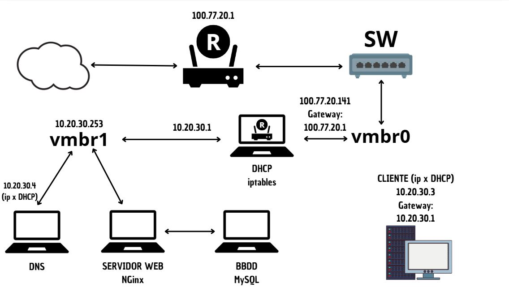

# TeamTactics©

## IDEA DEL PROYECTO Y OBJETIVO DEL TRABAJO

Nuestra idea del proyecto se basa en diseñar una aplicación web inspirada en el popular juego de Fantasy Football. El fantasy es un juego donde los usuarios crean su propio equipo, y la finalidad de este juego es obtener los máximos puntos posibles, estos puntos se consiguen mediante tus jugadores, los jugadores en la vida real dependiendo de como juega un partido, puede obtener muchos puntos o muy pocos puntos. Como ejemplo de puntuacion, si un jugador no tiene minutos de juego entonces tendra 0 puntos, y si otro jugador marca 4 goles, possiblemente tendra una puntuación de 25 puntos. 

Entonces nuestra idea es crear una página relacionada con esta idea. Hemos elegido esta idea porque ambos integrantes del equipo sabemos más o menos cómo funciona el futbol fantasy, y por eso creemos que es una gran opción escoger este tema, ya que nos parece muy interesante.

Nuestro objetivo será aplicar todas las tecnologías necesarias para aspirar a la máxima nota posible y poner en práctica los conocimientos aprendidos en el primer año, así como lo que aprenderemos en este segundo año, para hacerlo lo mejor posible. También el año pasado un grupo escogio la misma idea y viendo como lo hicieron, vimos sus errores y pensamos que lo podemos hacer mucho mejor.

Con el trello y el github mostraremos todo nuestro trabajo realizado para mostrar nuestros avanzes semanales y diarios

## OBLIGATORIO A APLICAR

__-Node.js & MySQL:__

Node.js es un entorno de ejecución para JavaScript en el servidor, ideal para construir aplicaciones web rápidas y escalables. 

MySQL es un sistema de gestión de bases de datos relacional que almacena y organiza datos de manera eficiente, facilitando consultas rápidas.

__-NGINX o Apache:__ 

Ambos son servidores web populares. NGINX es conocido por su rendimiento y capacidad para manejar múltiples conexiones simultáneas, 
mientras que Apache es altamente configurable y tiene una gran cantidad de módulos disponibles.

__-DNS + DHCP:__ 

DNS (Sistema de Nombres de Dominio) traduce nombres de dominio en direcciones IP, facilitando la navegación web. 

DHCP (Protocolo de Configuración Dinámica de Host) asigna automáticamente direcciones IP a dispositivos en una red, simplificando la gestión de redes.

## LOGO DEL EQUIPO

Nuestro logo lo hemos creado basándonos en el nombre de nuestro trabajo, Team Tactics. En él, se pueden ver dos "T" que hacen referencia al nombre del equipo. Tambien, hemos pensado este logo ya que con la forma y sus colores tiene mucha relación con el mundo del futbol.

El color negro y blanco creemos que queda muy estetico, que es eso lo que buscamos y lo que nos interesa.

## PALETA DEL EQUIPO

Los colores con los que vamos a trabajar son los siguientes, hemos considerado que esta paleta de colores puede cuadrar muy bien con la funcionalidad de la web y puede atraer visualmente a nuestro público objetivo
ya que son colores muy visuales y relacionados con el mundo de los videojuegos.

__-000000__

__-00FF00__

__-FFFFFF__

## TAREAS DE LOS INTEGRANTES

Ambos integrantes tocaremos de todo un poco. La idea es que los dos programemos, hagamos la base de datos, etc. Ahora estamos los dos trabajando juntos, y empezaremos cada uno a hacer sus 3 funcionalidades.

## NUESTRO MOCKUP Y ARBOL DE NAVEGACIÓN

Hemos diseñado un mockup de la aplicación a través de Canva, basándonos principalmente en nuestra paleta de colores. Además, hemos realizado un diseño lo más visual posible para atraer la atención del público que creemos podría estar interesado en nuestra aplicación. Nuestro público objetivo son hombres entre 13 y 40 años.

Aquí explicaremos el arbol de navegación de nuestra página web.
Para empezar tendremos una página principal, donde a la parte superior derecha se vera los siguentes botones:
 - Inicio
 - Plantillas
 - Estadísticas
 - Contacto
 - Login

El boton de inicio es para que cuando accedas a otro boton te lleve a la pagina principal.

El boton de plantillas te llevara al apartado de tu plantilla/equipo

El boton de estadísticas te llevara a la parte de estadisticas globales

EL boton de contacto es para que el usuario acceda a la pagina con su usuario creado. En ese apartado podrà iniciar sección.

Abajo de todo esto, se veràn los 20 escudos de la liga, donde si hacemos click a un escudo te llevara a ver información de ese equipo como: Plantilla, sitio en la clasificación etc..

Entonces abajo de esto mostraremos el mensaje de Juega a teamtactics, esto es para que el usuario vea de una forma un esquema de lo que va la web

Abajo de esto, veremos un apartado de pròximos partidos y lideres de la liga, ambas son como una mínima información. En cada apartado tendrá abajo derecha un boton que pondra como: Ver todos los partidos/Estadísticas, que te llevara a otro sitio, para ver toda la información.

Entonces, si le damos al botón de arriba derecha de estadísticas, te llevará a una página donde salgan todas las estadísticas, donde podremos ver:

 -Máximos goleadores
 

 -Máximos asistententes
 
 
 -Jugador con más disparos
 
 
 -Jugador con más pases.
 

 -Portero con más paradas.
 

 -Jugador con más tarjetas amarillas y rojas.

 Cada jugador que salga, si por ejemplo el jugador que es el máximo goleador es Lewandowski, saldrá el escudo del equipo y los minutos jugados.

Esta página de estadísticas también se podrá llegar a parte del botón arriba derecha en la parte que he comentado donde decía: Ver todas las estadísticas
Y si le damos al botón de ver todos los partidos, que se encuentra a abajo del todo de la página principal, nos llevará a otra página donde veremos todos los partidos jugados, y los puntos que todo el equipo ha conseguido, esto servirá para que el usuario mire los puntos que ha hecho cada jugador.

Ahora, en la página principal, si le damos a Crea tu equipo, te llevará a la página donde el usuario podrá crear el equipo. En esta página, se verá de fondo como un campo de fútbol negro, para que el usuario ponga sus jugadores a cada posición que corresponde.
Arriba, dentro de la misma página, se verá un balance. El balance principal empieza con 100.000.000, luego si el usuario hace incorporaciones, entonces el balance bajará. 
Abajo de esto, se verá un apartado de puntos, donde el usuario verá la suma total que ha realizado su equipo.
Y arriba derecha se verá el número de jugadores que tiene puestos en el campo de fútbol, normalmente esto será simple 11/11.

La opción de número de jugadores funcionará como un botón, donde, si hacemos click a esto, veremos nuestros jugadores, nombre, club, media puntos, puntos que ha hecho en una jornada y el valor de mercado.
La media de puntos se hará haciendo una media de los 37 partidos jugados.

También se verá un botón de mercado, para que el usuario pueda comprar jugadores en el mercado.
Todos los jugadores que el usuario ha comprado también pueden ser vendidos.

Luego, en el botón contacto pondremos un poco de información de nosotros para explicar un poco dentro de la página web el proceso del proyecto.

Y en el botón de inicio de sección, el usuario podrá hacer registro para poder acceder con su cuenta a la página, claro que si no tiene cuenta, tendrá que darle a crear cuenta, y luego de crear cuenta le tendrá que dar a iniciar sección.

El mockup y nuestra idea del trabajo creo que lo hemos entendido perfectamente. Sabemos que el árbol de navegación no será el mejor de la historia, pero para nosotros nos sirve cómo una buena guía de cómo funcionará la página.

## ARQUITECTURA DEL SISTEMA Y FUNCIONALIDADES

Nuestros objetos serán:
- Registro de usuarios
- Una zona de comentarios para todos los usuarios que se hayan agregado como amigos
- Una zona donde el usuario podrá modificar su perfil.
- Poner notificaciones para los usuarios
- Búsqueda de usuarios y poder agregarlos como amigos
- Y hacer obligatorio el uso de contraseña para cuando se entra a la aplicación.

  El día de la fecha de entrega puede variar

Ahora mostramos la arquitectura de nuestro trabajo.
  

## DIAGRAMA DE LA BASE DE DATOS

Los usuarios crean sus propios equipos, que consisten en jugadores de equipos reales, organizados en plantillas. 

Los usuarios pueden participar en ligas, competir entre sí y realizar transacciones de compra y venta de jugadores. Para calcular las puntuaciones, 
Se registran los partidos reales y las puntuaciones obtenidas por cada jugador en esos encuentros. 

Además, hemos incluido un sistema de Amigos, así como Roles para gestionar diferentes tipos de usuarios en la plataforma.

## ESQUEMA DE RED

Por el momento tenemos hecho este prototipo de mapa de red, aunque aun lo tenemos que hablar con Alina ya que no es el definitivo y queremos que nos aclare algunos conceptos que quizas no han quedado tan claros.

## PROXMOX

Por el momento, ya tenemos instalado el ProxMox en el PC de clase asignado de los que están atrás del todo. Una vez tengamos más claro el esquema de red definitivo, procederemos a empezar a configurarlo y documentarlo.

__Proxmox__ es una plataforma de virtualización de código abierto que permite gestionar máquinas virtuales y contenedores. Está basada en Debian y combina tecnologías como KVM (para la virtualización completa) y LXC (para la virtualización basada en contenedores).

Se utiliza principalmente en entornos de servidores para crear, administrar y orquestar múltiples VMs y contenedores de forma eficiente. También incluye herramientas para gestionar almacenamiento, redes y copias de seguridad. Además, soporta la creación de clusters para alta disponibilidad y migraciones en vivo, lo que lo hace ideal para centros de datos y servidores corporativos.

Es especialmente útil para:

-Consolidación de servidores: Ejecutar múltiples sistemas operativos en un solo servidor físico.

-Gestión de recursos: Controlar y distribuir recursos de hardware como CPU, memoria y almacenamiento.

-Automatización y alta disponibilidad: Ofrecer soluciones escalables y resistentes a fallos.
# INSTALACIONES

## CONFIGURACIÓN DE PROXMOX

[Ver archivo](M11UF4A2-QuimFernandez_PolCamarena.docx.pdf)

## CONFIGURACIÓN DE CLIENTE

En proceso de comentar...

## CONFIGURACIÓN DE DNS

En proceso de comentar...

Primero lo que hacemos es instalar el servicio DHCP:

Actualizamos: sudo apt update

sudo apt-get install isc-dhcp-server

Hacemos la configuración del archivo DHCP:

El archivo de configuración principal se encuentra en /etc/dhcp/dhcpd.conf. En este archivo, lo que hay que hacer es definir los parámetros de red, como el rango de direcciones IP, la puerta de enlace predeterminada, DNS y duración de la concesión. 

   
Esta es nuestra configuración:

subnet 10.20.30.0 netmask 255.255.255.248 {
  range 10.20.30.3 10.20.30.6;
  option routers 10.20.30.1;
  option domain-name-servers 8.8.8.8, 9.9.9.9;
  default-lease-time 600;
  max-lease-time 7200;
}

Configurar las interfaces de red:

Ahora  para comprobar y asegurarnos que la interfaz de red correcta esté configurada para proporcionar el servicio DHCP definimos  la interfaz en el archivo de configuración de red o directamente en /etc/default/isc-dhcp-server:

Reiniciar el servicio DHCP:

Una vez configurado, hay que reiniciar el servicio para aplicar los cambios:
bash

sudo systemctl restart isc-dhcp-server
Comprobación:

 Y para verifica si el servidor DHCP está funcionando correctamente:
bash

sudo systemctl status isc-dhcp-server

En proceso de comentar...

## CONFIGURACIÓN DE NGINX

En proceso de comentar...

## BASE DE DATOS

Aquí mostramos el esquema final de la base de datos, donde hemos añadido algunas conexiones que no habíamos tomado en cuenta. Hemos creado la base con MySQL WorkBench a través de SQL y una vez ejecutado el código, gracias a la función de la creación de diagramas, hemos podido ver las tablas y sus conexiones.

## BIBLIOGRAFIA

https://punkymo.gitbook.io/miwiki

