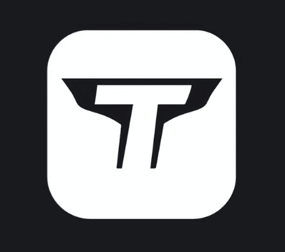

# TeamTactics©

## IDEA DEL PROYECTO Y OBJETIVO DEL TRABAJO

Nuestra idea del proyecto se basa en diseñar una aplicación web inspirada en el popular juego de Fantasy Football. El fantasy es un juego donde los usuarios crean su propio equipo, y la finalidad de este juego es obtener los máximos puntos posibles, estos puntos se consiguen mediante tus jugadores, los jugadores en la vida real dependiendo de como juega un partido, puede obtener muchos puntos o muy pocos puntos. Como ejemplo de puntuacion, si un jugador no tiene minutos de juego entonces tendra 0 puntos, y si otro jugador marca 4 goles, possiblemente tendra una puntuación de 25 puntos. 

Entonces nuestra idea es crear una página relacionada con esta idea. Hemos elegido esta idea porque ambos integrantes del equipo sabemos más o menos cómo funciona el futbol fantasy, y por eso creemos que es una gran opción escoger este tema, ya que nos parece muy interesante.

Nuestro objetivo será aplicar todas las tecnologías necesarias para aspirar a la máxima nota posible y poner en práctica los conocimientos aprendidos en el primer año, así como lo que aprenderemos en este segundo año, para hacerlo lo mejor posible. También el año pasado un grupo escogio la misma idea y viendo como lo hicieron, vimos sus errores y pensamos que lo podemos hacer mucho mejor.

Con el trello y el github mostraremos todo nuestro trabajo realizado para mostrar nuestros avanzes semanales y diarios

## OBLIGATORIO A APLICAR

__-Node.js & MySQL:__

Node.js es un entorno de ejecución para JavaScript en el servidor, ideal para construir aplicaciones web rápidas y escalables. 

MySQL es un sistema de gestión de bases de datos relacional que almacena y organiza datos de manera eficiente, facilitando consultas rápidas.

__-NGINX o Apache:__ 

Ambos son servidores web populares. NGINX es conocido por su rendimiento y capacidad para manejar múltiples conexiones simultáneas, 
mientras que Apache es altamente configurable y tiene una gran cantidad de módulos disponibles.

__-DNS + DHCP:__ 

DNS (Sistema de Nombres de Dominio) traduce nombres de dominio en direcciones IP, facilitando la navegación web. 

DHCP (Protocolo de Configuración Dinámica de Host) asigna automáticamente direcciones IP a dispositivos en una red, simplificando la gestión de redes.

## LOGO DEL EQUIPO

Nuestro logo lo hemos creado basándonos en el nombre de nuestro trabajo, Team Tactics. En él, se pueden ver dos "T" que hacen referencia al nombre del equipo. Tambien, hemos pensado este logo ya que con la forma y sus colores tiene mucha relación con el mundo del futbol.

El color negro y blanco creemos que queda muy estetico, que es eso lo que buscamos y lo que nos interesa.

## PALETA DEL EQUIPO

Los colores con los que vamos a trabajar son los siguientes, hemos considerado que esta paleta de colores puede cuadrar muy bien con la funcionalidad de la web y puede atraer visualmente a nuestro público objetivo
ya que son colores muy visuales y relacionados con el mundo de los videojuegos.

__-000000__

__-00FF00__

__-FFFFFF__

## TAREAS DE LOS INTEGRANTES

Ambos integrantes tocaremos de todo un poco. La idea es que los dos programemos, hagamos la base de datos, etc. Ahora estamos los dos trabajando juntos, y empezaremos cada uno a hacer sus 3 funcionalidades.

## NUESTRO MOCKUP Y ARBOL DE NAVEGACIÓN

Hemos diseñado un mockup de la aplicación a través de Canva, basándonos principalmente en nuestra paleta de colores. Además, hemos realizado un diseño lo más visual posible para atraer la atención del público que creemos podría estar interesado en nuestra aplicación. Nuestro público objetivo son hombres entre 13 y 40 años.

Aquí explicaremos el arbol de navegación de nuestra página web.
Para empezar tendremos una página principal, donde a la parte superior derecha se vera los siguentes botones:
 - Inicio
 - Plantillas
 - Estadísticas
 - Contacto
 - Login

El boton de inicio es para que cuando accedas a otro boton te lleve a la pagina principal.

El boton de plantillas te llevara al apartado de tu plantilla/equipo

El boton de estadísticas te llevara a la parte de estadisticas globales

EL boton de contacto es para que el usuario acceda a la pagina con su usuario creado. En ese apartado podrà iniciar sección.

Abajo de todo esto, se veràn los 20 escudos de la liga, donde si hacemos click a un escudo te llevara a ver información de ese equipo como: Plantilla, sitio en la clasificación etc..

Entonces abajo de esto mostraremos el mensaje de Juega a teamtactics, esto es para que el usuario vea de una forma un esquema de lo que va la web

Abajo de esto, veremos un apartado de pròximos partidos y lideres de la liga, ambas son como una mínima información. En cada apartado tendrá abajo derecha un boton que pondra como: Ver todos los partidos/Estadísticas, que te llevara a otro sitio, para ver toda la información.

Entonces si le damos al boton de arriba derecha de estadisticas, te llevera a una pagina donde salga todas las estadisticas, donde podremos ver:

 -Máximos goleadores

 -Máximos asistententes
 
 -Jugador con mas disparos
 
 -Jugador con más pases

 -Portero con más paradas

 -Jugador con mas tarjetas amarillas y rojas

 Cada jugador que salga, si por ejemplo el jugador que es el máximo goleador es Lewandowski, saldra el escudo del equipo y los minutos jugados

Está página de estadisticas tambien se podra llegar a parte del boton arriba derecha en la parte que he comentado donde decia: Ver todas las estadísticas
Y si le damos al boton de ver todos los partidos, que se encuentra a abajo del todo de la página principal, nos llevara a otra página donde veremos todos los partidos jugados, y los puntos que todo el equipo ha conseguido, esto servira para que el usuario mire los puntos que ha hecho cada jugador

Ahora, en la pagina principal, si le damos a crea tu equipo, te llevara a la página donde el usuario podra crear el equipo. En esta pagina, se vera de fondo como un campo de futbol negro, para que el usuario ponga sus jugadores a cada posición que corresponde.
Arriba dentro de la misma página, se vera un balance, el balance principal empieza con 100.000.000, luego si el usuario hace incorporaciones entonces el balance bajará. 
Abajo de esto, se vera un apartado de puntos, donde el usuario verá la suma total que ha realizado su equipo.
Y arriba derecha se verá el número de jugadores que tiene puestos en el campo de futbol, normalmente esto será simpre 11/11.

La opcion de numero de jugadores funcionará como un boton, donde si hacemos click a esto, veremos nuestros jugadores, nombre, club, media puntos, puntos que ha hecho en una jornada y el valor de mercado
La media de puntos se hara haciendo una media de los 37 partidos jugados.

Tambien se verà un boton de Mercado, para que el usuario podra comprar jugadores en el mercado.
Todos los jugadores que el usuario ha comprado, tambien pueden ser vendidos.

Luego en el boton contacto pondremos un poco de información de nosotros para explicar un poco dentra de la página web el processo del proyecto.

Y en el boton de inicio de sección, el usuario podrá hacer registro para poder acceder con su cuenta a la página, claro que si no tiene cuenta, tendra que darle a crear cuenta, y luego de crear cuenta le tendrá que dar a iniciar sección

El mockup y nuestra idea del trabajo creo que lo hemos entendido perfectamente. Sabemos que el al árbol de navegación no será el mejor de la história, pero para nosotros nos sirve cómo una buena guia de cómo funcionará la página.

## BIBLIOGRAFIA

Para la bibliografia, basicamente como la idea era muy clara, no hemos accedido a muchas páginas webs. Lo unico que hemos cogido como idea ha sido la propia app fantasy, y dentro de la página oficial de la Uefa champions league hemos visto la estética de la tabla de estadísticas y también la tabla de clasificación

## ARQUITECTURA DEL SISTEMA Y FUNCIONALIDADES

Nuestros objetos serán:
- Registro de usuarios
- Una zona de comentarios para todos los usuarios que se hayan agregado como amigos
- Una zona donde el usuario podrá modificar su perfil
- Poner notificaciones para los usuarios
- Busqueda de usuarios y poder agregarlos como amigos
- Y hacer obligatorio el uso de contraseña para cuando se entra a la aplicación

  El dia de la fecha entrega puede variar

Ahora mostramos la arquitectura de nuestro trabajo
  

## DIAGRAMA DE LA BASE DE DATOS

Este diagrama no es el definitivo, lo tenemos que hablar con el joaquin para que nos diga su opinión.

Los Usuarios crean sus propios Equipos, que consisten en Jugadores de equipos reales, organizados en Plantillas. 

Los usuarios pueden participar en Ligas, competir entre sí y realizar Transacciones de compra y venta de jugadores. Para calcular las puntuaciones, 
se registran los Partidos reales y las Puntuaciones obtenidas por cada jugador en esos encuentros. 

Además, hemos incluido un sistema de Amigos, así como Roles para gestionar diferentes tipos de usuarios en la plataforma.

## ESQUEMA DE RED

## PROXMOX

