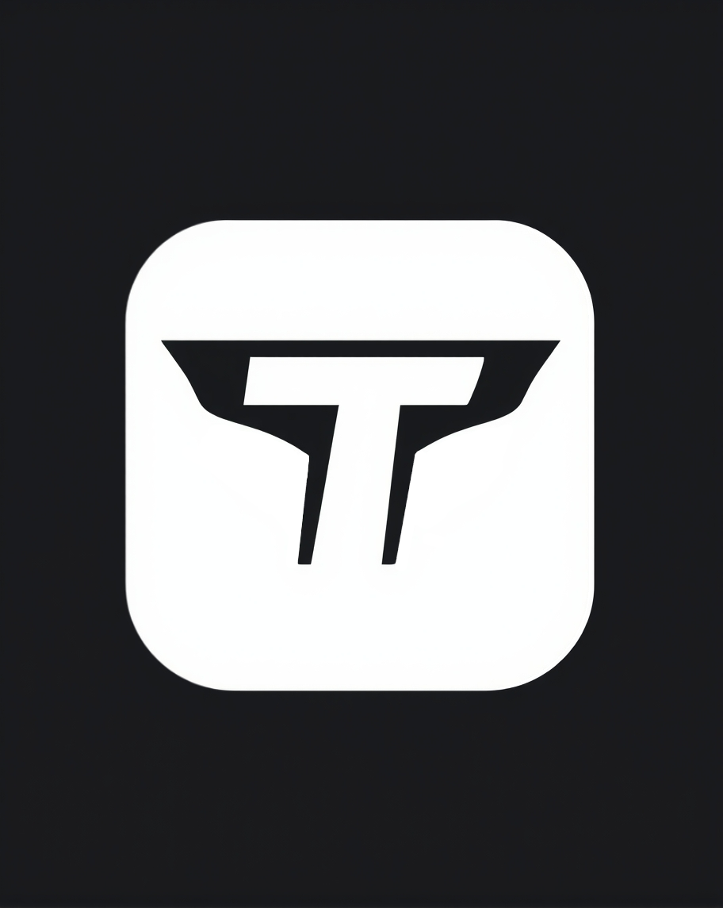

# IDEA DEL PROYECTO Y OBJETIVO DEL TRABAJO

Nuestra idea del proyecto se basa en diseñar una aplicación web inspirada en el popular juego de Fantasy Football. Hemos elegido esta idea porque ambos integrantes sabemos más o menos cómo funciona. Creemos que es una gran opción escoger este tema, ya que nos parece muy interesante.

Nuestro objetivo será aplicar todas las tecnologías necesarias para aspirar a la máxima nota posible y poner en práctica los conocimientos aprendidos en el primer año, así como lo que aprenderemos en este segundo año, para hacerlo lo mejor posible.


## NUESTRO MOCKUP

Hemos diseñado un mockup de la aplicación a través de Canva, basándonos principalmente en nuestra paleta de colores. Además, hemos realizado un diseño lo más visual posible para atraer la atención del público que creemos podría estar interesado en nuestra aplicación. Nuestro público objetivo son hombres entre 13 y 40 años.

## LOGO DEL EQUIPO

Nuestro logo lo hemos creado basándonos en el nombre de nuestro trabajo, Team Tactics. En él, se pueden ver dos "T" que hacen referencia al nombre del equipo.
 width="200px"


## TAREAS DE LOS INTEGRANTES

Ambos integrantes tocaremos de todo un poco. La idea es que los dos programemos, hagamos la base de datos, etc.

## OBLIGATORIO DE APLICAR

-NODE.JS  &  MYSQL  
-NGINX o APACHE  
-.DNS + DHCP

## PALETA DEL EQUIPO

```bash
111111

00ff00 
